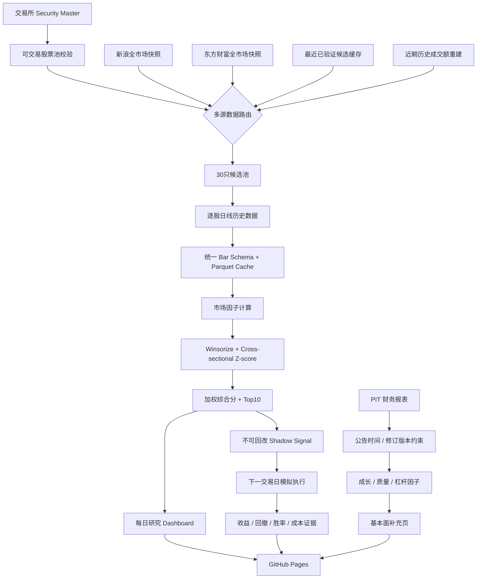

<div align="center">

# A-share Analysis System

### 个人 A 股量化研究、选股与前瞻验证平台

从公开市场数据开始，完成股票池构建、因子评分、Point-in-Time 基本面、A 股交易规则回测、云端日更与不可回改的影子实盘记录。

[](https://www.python.org/)
[](./pyproject.toml)
[](https://github.com/wangqiyue26-lab/A-share-analysis-system/actions/workflows/ci.yml)
[](https://github.com/wangqiyue26-lab/A-share-analysis-system/actions/workflows/daily.yml)
[](#当前状态)
[](#影子实盘与前瞻验证)

**[🌐 在线研究 Dashboard](https://wangqiyue26-lab.github.io/A-share-analysis-system/)** · **[📚 研究文档](./docs)** · **[⚙️ GitHub Actions](https://github.com/wangqiyue26-lab/A-share-analysis-system/actions)**

</div>

> [!IMPORTANT]
> 这个项目目前是**量化研究与影子实盘验证系统**，不是一个已经通过长期实盘检验的“自动荐股程序”。当前正式生产仍使用一个为云端稳定性设计的 **30 只沪深候选池 → Top10** 流程；扩大股票池、严格滚动验证和组合风险控制仍在继续建设。`real_money_ready` 在当前阶段固定为 `false`。

---

## 目录

- [项目解决什么问题](#项目解决什么问题)
- [当前状态](#当前状态)
- [系统工作流](#系统工作流)
- [数据源与可靠性](#数据源与可靠性)
- [市场因子模型](#市场因子模型)
- [Point-in-Time 基本面](#point-in-time-基本面)
- [影子实盘与前瞻验证](#影子实盘与前瞻验证)
- [A 股交易规则建模](#a-股交易规则建模)
- [每日自动化](#每日自动化)
- [输出与研究证据](#输出与研究证据)
- [项目结构](#项目结构)
- [快速开始](#快速开始)
- [Roadmap](#roadmap)
- [研究纪律](#研究纪律)
- [常见问题](#常见问题)
- [免责声明](#免责声明)

---

## 项目解决什么问题

大多数个人选股脚本只回答一个问题：**“今天谁的分数最高？”**

这个项目希望解决的是更完整的一条链路：

1. 数据从哪里来，数据源失效时怎么办；
2. 当天真实可交易的股票池是什么；
3. 哪些因子贡献了排名；
4. 财报是否在当时已经公开，而不是事后回填；
5. A 股 T+1、涨跌停、停牌、ST、手续费和滑点是否被正确模拟；
6. 每天真正产生过什么信号，能否防止事后修改历史；
7. 一个策略究竟是在历史上“拟合得漂亮”，还是能够持续通过前瞻验证。

因此，这个仓库更接近一个**个人量化研究基础设施**，而不是单一的选股公式。

### 当前已具备的能力

| 能力 | 状态 | 说明 |
| --- | :---: | --- |
| 多数据源行情路由 | ✅ | 新浪 / 东方财富 + 缓存与历史成交额降级链 |
| 股票池与流动性筛选 | ✅ | 上市状态、ST、上市天数、交易所、成交额检查 |
| 可解释市场因子 | ✅ | 动量、趋势、波动、回撤、流动性 |
| 横截面标准化与综合评分 | ✅ | Winsorize + z-score + 权重配置 |
| PIT 财务数据 | ✅ | 保留公告/可见时间与后续修订版本 |
| A 股交易规则回测 | ✅ | T+1、涨跌停、停牌、手续费、印花税、滑点 |
| 沪深300基准研究基础 | ✅ | 用于后续严格相对收益验证 |
| GitHub Actions 云端日更 | ✅ | 不依赖本地电脑持续开机 |
| GitHub Pages Dashboard | ✅ | 每日研究结果自动发布 |
| 严格股票池证据留存 | ✅ | security-master 快照 + checksum + 90 天 artifact |
| 前瞻影子实盘 | 🟡 | 已上线，正在积累不可回改的真实时间序列 |
| 扩大股票池后的严格滚动验证 | 🚧 | 下一阶段重点 |
| 小资金实盘门槛 | 🔒 | 尚未开放 |
| ML / Qlib / LightGBM | ⏳ | 后续阶段，不急于提前引入 |

---

## 当前状态

当前系统已经能在 GitHub 云端自动完成一整套每日研究任务，但项目刻意区分了“**能运行**”与“**值得拿真钱运行**”。

```text
数据管线可用            ██████████  ✅
每日选股生产            ██████████  ✅
PIT 基本面              ██████████  ✅
交易规则回测            ██████████  ✅
影子实盘证据            ███░░░░░░░  🟡 持续积累中
严格滚动验证            ██░░░░░░░░  🚧
真实资金准备度          ░░░░░░░░░░  🔒 false
```

### 当前生产基线

- **市场范围**：沪深 A 股（当前生产候选池暂不含北交所）。
- **候选池**：每日构建 30 只高流动性候选股票。
- **最终研究排名**：Top10。
- **生产评分**：只使用可解释市场因子。
- **基本面因子**：已经计算，但目前只作为补充解释层，不参与正式综合分。
- **影子组合**：Top10 等权，虚拟本金 100 万元。
- **真实资金状态**：`real_money_ready = false`。

> 30 只候选池是当前免费公网数据源和 GitHub 云端稳定性约束下的生产起点，不代表最终研究范围已经足够。系统下一阶段会在数据证据允许的前提下继续扩大股票池。

---

## 系统工作流



这条链路最重要的设计原则是：**研究结果必须能够解释、复现、追溯，并且尽量避免未来数据泄漏。**

---

## 数据源与可靠性

免费公网 A 股数据的最大问题不是“没有数据”，而是**云端运行时端点会随机超时、限流或断开连接**。因此系统没有押注单一数据源。

### 当前候选池数据路由

```text
一级实时源 A：新浪全市场行情
        ↓ 失败 / 覆盖不足
一级实时源 B：东方财富全市场行情
        ↓ 失败 / 覆盖不足
最近 3 天已验证候选缓存（重新经过 security-master 校验）
        ↓ 不可用
当前股票池 + 逐股近期历史成交额重建
        ↓ 极端故障
显式灾难级 fallback
```

### 数据质量门槛

实时全市场接口并不是“返回 HTTP 200 就算成功”。当前生产还会检查：

- 沪深当前上市证券覆盖率；
- ST 状态；
- 上市天数；
- 交易所范围；
- 成交额完整性；
- Security Master 是否完整；
- 行情日期是否一致；
- 缓存是否已经过期。

全市场实时快照覆盖不足时，即使接口本身有返回，也会被拒绝作为正常一级源。

### 为什么保留缓存和历史重建

免费网页行情接口本身没有 SLA。系统的目标不是假装它们永远可靠，而是做到：

> **单个数据端点故障，不应该直接导致整个每日研究任务失败；但降级数据也不能被悄悄伪装成正常数据。**

因此 Dashboard 和 manifest 会保留数据源、warning 与 fallback 状态，方便后续审计。

---

## 市场因子模型

当前正式生产评分故意保持简单、透明、可解释。

| 因子 | 含义 | 默认方向 |
| --- | --- | :---: |
| `momentum_20` | 20 个交易日价格动量 | ↑ 越高越好 |
| `momentum_60` | 60 个交易日价格动量 | ↑ 越高越好 |
| `trend_ma20_ma60` | MA20 / MA60 趋势差 | ↑ 越高越好 |
| `volatility_20` | 20 日年化实现波动率 | ↓ 越低越好 |
| `max_drawdown_60` | 过去 60 日最大回撤幅度 | ↓ 越低越好 |
| `log_amount_20` | 20 日平均成交额的对数 | ↑ 流动性更高 |

因子先经过极值处理，再进行横截面 z-score 标准化，最后按照 [`config/factors.yml`](./config/factors.yml) 中的权重和方向生成综合分。

系统同时保留：

- 原始因子值；
- 标准化后因子值；
- 综合分；
- 排名；
- 因子覆盖率；
- 被排除股票与原因。

这样可以在结果异常时回答“**为什么这只股票排在这里**”，而不是只看到一个无法解释的模型分数。

---

## Point-in-Time 基本面

财务数据最容易出现的研究错误之一，是用“今天知道的财报”去解释“过去当时不知道的市场”。

本项目的 PIT 财务层要求每条事实至少具备：

- `period_end`：财报对应报告期；
- `published_at / available_at`：该信息什么时候真实可见；
- 修订版本：后来修订的数据不能覆盖掉早期可见版本；
- `source`：来源；
- 缓存与过期策略。

当前补充因子包括：

| 基本面因子 | 说明 |
| --- | --- |
| 营收同比 | 收入增长质量的基础观察 |
| 净利润同比 | 盈利增长 |
| 净利率 | 盈利能力 |
| 经营现金流 / 净利润 | 盈利与现金流匹配程度 |
| 资产负债率 | 财务杠杆 |
| Fundamental Coverage | 当前时点可计算因子的覆盖率 |

这些基本面因子已经显示在独立页面中，但**暂不进入正式生产综合分**。只有在积累足够严格历史股票池快照和多个财报周期后，才会验证其是否具有真实的样本外增量价值。

进一步阅读：[`docs/pit_fundamental_enrichment.md`](./docs/pit_fundamental_enrichment.md) · [`docs/strict_rolling_research.md`](./docs/strict_rolling_research.md)

---

## 影子实盘与前瞻验证

Phase 4H 开始后，系统不再只做“历史回测”，而是每天保存它在**当时真正会做出的决定**。

### 基线模拟组合

| 项目 | 当前规则 |
| --- | --- |
| 初始虚拟资金 | ¥1,000,000 |
| 组合 | 每日 Top10 |
| 权重 | 等权 |
| 信号时间 | 当日收盘后 |
| 最早成交 | 下一交易日开盘 |
| 交易约束 | T+1 / 涨跌停 / 停牌 / 100 股整数手 |
| 成本 | 佣金 + 印花税 + 滑点 |
| 基本面是否参与选股 | 否，仍是补充研究层 |
| 真实资金状态 | `false` |

### 不可回改的信号证据

每天首次观察到的正式信号保存为：

```text
research/shadow/signals/YYYY-MM-DD.csv
```

其中记录：

- 当天排名；
- 股票代码与名称；
- 综合分；
- 目标权重；
- 板块与 ST 元数据；
- 数据来源；
- 策略版本；
- 第一次观察到该信号的时间。

如果同一个市场日期以后重新运行，系统允许读取**完全相同**的信号，但如果新结果试图覆盖当天已经锁定的不同排名，流水线会拒绝改写。

这解决了量化研究里非常重要的一个问题：**不能在知道结果以后回头把过去的决定改得更漂亮。**

### 影子组合会统计什么

- 累计收益率；
- 年化收益率；
- 年化波动率；
- 最大回撤；
- Sharpe Ratio；
- 组合每日正收益比例；
- 模拟交易笔数；
- 实际成交与成本；
- 累计观察交易日；
- 后续增加基准超额、个股持有期命中率、行业归因与换手分析。

### 固定观察窗口

| 阶段 | 规则 |
| --- | --- |
| 0–19 个收益观察日 | 只收集证据，不因为短期盈亏改因子 |
| 第 20 日 | 第一次诊断：数据、成本、换手、集中度、明显执行问题 |
| 20–59 日 | 持续前瞻收集，仅比较预先声明的策略版本 |
| 60+ 日 | 开始更严格的滚动验证、基准归因与市场环境分析 |

详细协议见 [`docs/shadow_trading.md`](./docs/shadow_trading.md)。

---

## A 股交易规则建模

回测和影子实盘尽量避免使用“理论上可以买卖”的理想化假设。

当前交易引擎已经处理：

- **T+1**：当天买入不能当天卖出；
- **涨跌停**：不同板块使用对应价格限制；
- **创业板 / 科创板 / 主板差异**；
- **ST 价格限制**；
- **停牌 / 零成交量**：订单延后；
- **100 股整数手**；
- **佣金最低收费**；
- **历史印花税规则**；
- **滑点**；
- **订单无法成交时延后重试**。

策略信号与真实成交被分开：收盘后的信号只能在下一交易日及以后执行，这也是防止未来函数的重要边界。

---

## 每日自动化

系统的生产环境是 **GitHub Actions**，因此日常运行不要求本地电脑保持开机。

### 生产时间

主工作流在工作日中国 A 股收盘后运行。目前 cron 为：

```yaml
23 9 * * 1-5
```

即 **09:23 UTC / 北京时间 17:23**。

### 三类自动化任务

| Workflow | 作用 |
| --- | --- |
| `.github/workflows/ci.yml` | Ruff、单元测试、CLI health、真实公网 smoke test |
| `.github/workflows/daily.yml` | 股票池 → 历史行情 → 因子 → Top10 → PIT 基本面 → Shadow → Pages |
| `.github/workflows/pages.yml` | 手工预览 / Pages 辅助任务 |

普通代码 `push` 可以验证生产链，但**不会写入正式影子交易信号**。只有主分支的定时/手工正式运行才允许锁定模拟交易证据，避免开发行为污染前瞻样本。

---

## 输出与研究证据

一次完整生产会产生多层输出。

### 每日选股

```text
reports/production/selection/
├── ranking.csv
├── ranking.json
├── selected.csv
├── selected.json
├── exclusions.csv
├── summary.json
├── fundamentals.csv
└── fundamental_summary.json
```

### 影子实盘

```text
reports/production/shadow/
├── equity_curve.csv
├── trades.csv
├── signal_history.csv
└── metrics.json
```

### 长期证据

```text
research/shadow/signals/
└── YYYY-MM-DD.csv
```

此外，完整 Security Master 观察会被生成带 SHA-256 校验信息的 90 天 GitHub Actions artifact，用于未来严格滚动研究。

### GitHub Pages

在线 Dashboard：

**https://wangqiyue26-lab.github.io/A-share-analysis-system/**

页面会展示每日研究排名、数据源状态和 PIT 基本面；影子实盘形成正式记录后，会继续展示模拟组合表现与验证阶段。

---

## 项目结构

```text
A-share-analysis-system/
├── .github/workflows/        # CI、每日生产、Pages
├── config/                   # 因子权重与系统配置
├── data/                     # 本地/Actions 缓存目录（大数据不进 Git）
├── docs/                     # 生产、PIT、严格滚动、Shadow 等研究文档
├── reports/                  # 运行时研究产物
├── research/shadow/signals/  # 小体积、不可回改的前瞻决策证据
├── src/ashare_system/
│   ├── backtest/             # A 股交易规则、成本、回测引擎、绩效指标
│   ├── data/                 # 行情、财务、Security Master、PIT、缓存、路由
│   ├── factors/              # 市场因子与基本面因子
│   ├── production.py         # 每日选股生产
│   ├── robust_universe.py    # 多源候选池路由
│   ├── shadow_trading.py     # 前瞻影子实盘
│   ├── enrich_daily.py       # PIT 基本面增强
│   ├── reporting.py          # 研究输出
│   └── site.py               # 静态 Dashboard
├── tests/                    # 单元测试 / 回归测试
├── pyproject.toml
└── README.md
```

---

## 快速开始

要求 Python **3.11+**。

```bash
git clone https://github.com/wangqiyue26-lab/A-share-analysis-system.git
cd A-share-analysis-system

python -m pip install -e ".[dev]"
```

运行测试：

```bash
ruff check src tests
pytest -q
```

检查 CLI：

```bash
ashare-system health
```

真实公网行情 smoke test：

```bash
ashare-system smoke-data \
  --symbol 000001 \
  --start 20240102 \
  --end 20240110
```

> 网络 smoke test 会真实访问公开 A 股数据接口，因此它反映的是“代码 + 当前外部数据源”的联合状态；普通单元测试不依赖外部网络。

---

## Roadmap

| 阶段 | 状态 | 内容 |
| --- | :---: | --- |
| Phase 1 — Foundation | ✅ | 数据接口、统一格式、缓存、配置、日志、CI |
| Phase 2A — Market Factor Engine | ✅ | 股票池、技术/市场因子、标准化、综合评分 |
| Phase 3 — China Backtest Foundation | ✅ | T+1、涨跌停、停牌、ST、成本、PIT 基础设施、基准 |
| Phase 4B — Cloud Daily Production | ✅ | 云端候选池、Top10、Dashboard、Pages |
| Phase 4C — PIT Fundamentals | ✅ | 公告时间约束的财务事实、修订版本与因子 |
| Phase 4D — Fundamental Research Layer | ✅ | Top10 基本面补充页与失败隔离 |
| Phase 4F — Strict Rolling Evidence | ✅ | Security Master 快照与严格历史证据 |
| Phase 4G — Resilient Data Routing | ✅ | 新浪 / 东方财富一级源与多层 fallback |
| Phase 4H — Forward Shadow Trading | 🟡 | 不可回改信号、下一日模拟执行、前瞻绩效 |
| Strict Rolling Validation | 🚧 | 扩大股票池、超额收益、行业偏置、换手与市场环境 |
| Portfolio Risk Layer | ⏳ | 仓位、集中度、现金比例、组合回撤与暂停机制 |
| Real-money Readiness Gate | 🔒 | 达到硬性门槛后才考虑小资金真实测试 |
| Phase 5 — ML Lab | ⏳ | Qlib / LightGBM / Walk-forward / 模型集成 |

机器学习被放在后面是刻意的：**先证明数据、回测、执行和前瞻证据可靠，再增加模型复杂度。**

---

## 研究纪律

这个项目有几条比“某个因子权重是多少”更重要的原则。

### 1. 不用未来股票池重建过去

如果某个历史时点之前没有真实留存的 Security Master 快照，严格研究会选择失败关闭，而不是拿今天的上市股票名单假装那就是当年的股票池。

### 2. 不用未来财报解释过去

财务事实按 `available_at` 控制可见时间，并保留后续修订版本。

### 3. 不为了短期盈利修改历史

每日 Shadow Signal 一旦锁定，就不能被新排名覆盖。

### 4. 不把数据源故障隐藏起来

实时源、缓存、历史重建等状态必须显式记录。

### 5. 不把复杂度当作优势

在简单市场因子和执行链没有通过足够前瞻验证之前，不急于上线 ML 黑箱。

### 6. 不用单一指标判断策略

收益率之外，还必须同时看最大回撤、换手率、成本、波动、基准超额、行业集中度和不同市场阶段的稳定性。

---

## 常见问题

<details>
<summary><strong>这个系统现在会直接告诉我买哪只股票吗？</strong></summary>

会产生每日 Top10 **研究排名**，但当前不把它定义为真实资金买入建议。系统正在通过影子实盘积累前瞻证据，真实资金门槛仍然关闭。

</details>

<details>
<summary><strong>为什么现在只从 30 只候选股票里选 Top10？</strong></summary>

这是免费公网全市场端点在 GitHub 云 Runner 上存在限流、断连和超时情况下的生产稳定性起点。30 只并不是最终目标。未来会在数据源、严格历史股票池证据和运行成本允许的情况下扩大研究范围。

</details>

<details>
<summary><strong>为什么不用收费数据？</strong></summary>

当前目标是在零额外行情数据成本下先证明研究流程本身是否有效，因此优先使用公开数据、多源路由、缓存和显式降级。若未来策略本身经过验证，再评估是否有必要为更高 SLA 的数据服务付费。

</details>

<details>
<summary><strong>为什么基本面已经有了，却不直接放进综合评分？</strong></summary>

“有因子”不等于“因子有增量价值”。基本面必须在严格 PIT 数据和足够多报告周期上完成样本外验证，确认不会增加过拟合、行业偏置或换手问题后，才可能进入正式评分。

</details>

<details>
<summary><strong>影子实盘盈利后是不是就可以直接上真钱？</strong></summary>

不是。影子收益只是证据的一部分。真正的实盘准备度还需要更广股票池、基准相对表现、最大回撤、成本、换手、市场环境稳定性和组合风险规则共同通过门槛。

</details>

<details>
<summary><strong>需要每天开着自己的电脑吗？</strong></summary>

不需要。生产任务在 GitHub Actions 上运行，研究结果通过 GitHub Pages 发布。本地环境主要用于开发和手工调试。

</details>

---

## 进一步阅读

- [`docs/production_pipeline.md`](./docs/production_pipeline.md) — 云端生产与存储规则
- [`docs/pit_fundamental_enrichment.md`](./docs/pit_fundamental_enrichment.md) — PIT 基本面增强
- [`docs/strict_rolling_research.md`](./docs/strict_rolling_research.md) — 严格滚动研究边界
- [`docs/shadow_trading.md`](./docs/shadow_trading.md) — 前瞻影子交易协议
- [`THIRD_PARTY_NOTICES.md`](./THIRD_PARTY_NOTICES.md) — 第三方组件说明

---

## 数据与存储策略

大规模行情历史**不提交进 Git**。

- 可重建的行情与财务数据：GitHub Actions cache / `data/cache/`；
- 每日中间产物：短期 workflow artifacts；
- 完整 Security Master：额外保留 90 天研究 artifact；
- GitHub Pages：只发布生成后的静态研究页面；
- `research/shadow/signals/`：只保存小体积的每日决策证据，用于防止 hindsight rewrite。

这种设计尽量在**仓库体积、可复现性、免费云端运行成本和研究严谨性**之间取得平衡。

---

## 免责声明

本项目用于**量化研究、软件工程实验与策略验证**。

项目输出是研究信号，不构成证券投资建议、收益承诺或任何形式的保证。历史回测和模拟交易均不能保证未来表现。A 股交易存在市场风险、流动性风险、模型风险、数据质量风险和实际成交偏差；任何真实资金决策都应由使用者自行判断并承担结果。

---

<div align="center">

**Build evidence first. Add complexity later.**

先让系统证明自己，再决定是否值得承担真实资金风险。

</div>
